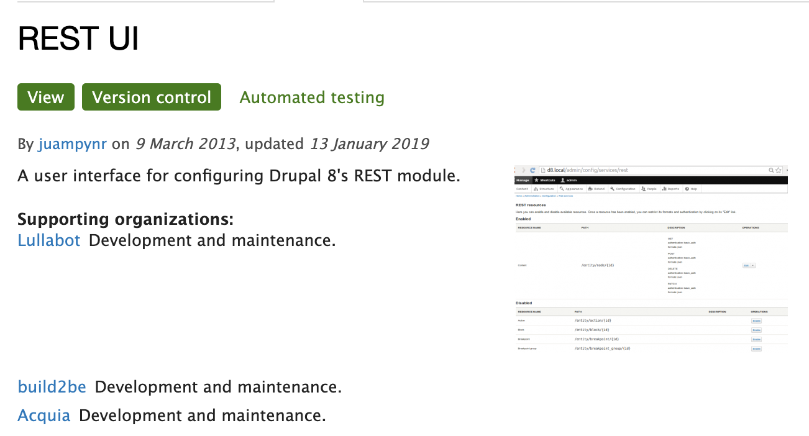
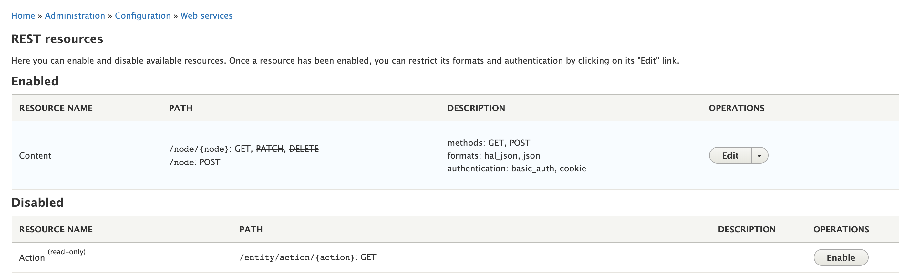
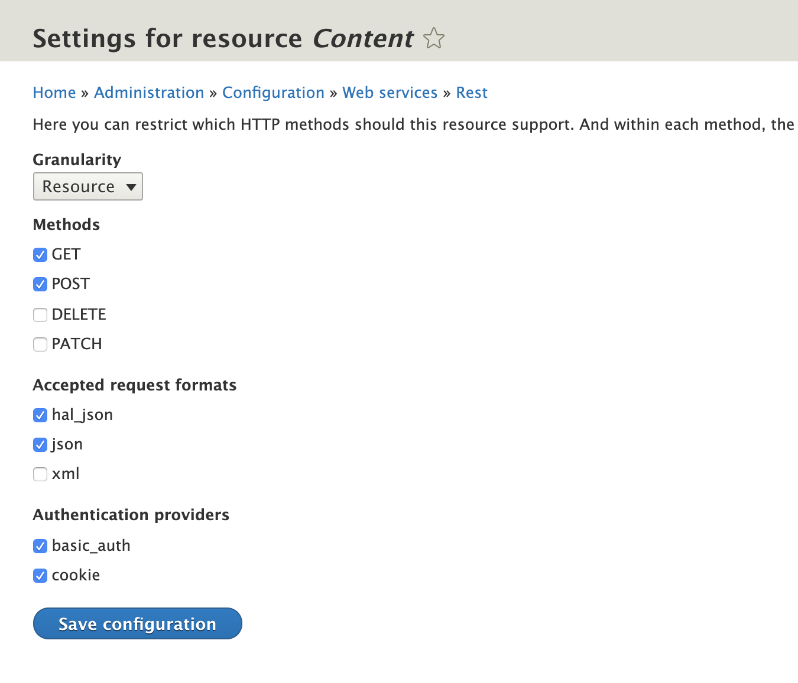
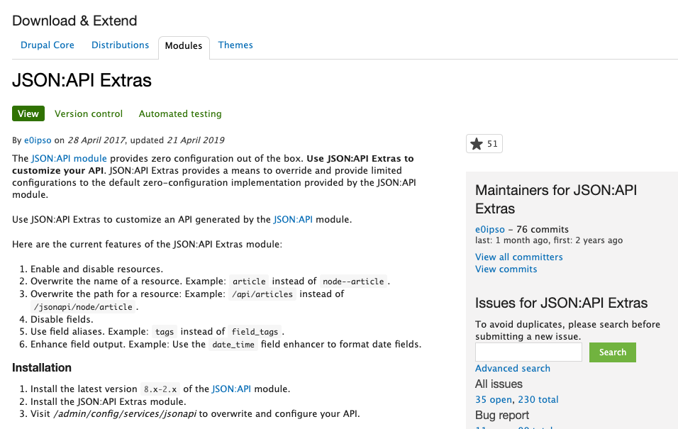
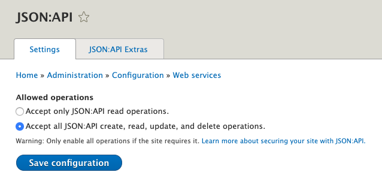
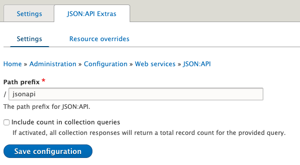
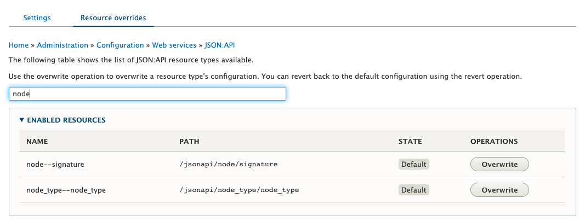

import future from "@mdx-deck/themes/future";
import highlight from "@mdx-deck/themes/syntax-highlighter-prism";
import { Notes } from "mdx-deck";

export const themes = [future, highlight];

# REST, GraphQL o JSON:API

## (qué no hacer)

---

# ¿Por qué hablar de esto?

<Notes>
  <div>- Tendencia: Backend/Frontend desacoplado.</div>{" "}
  <div>
    - Aprovechar seguridad, eg: gatsby al frente, más difícil saber qué hay
    detrás.
  </div>{" "}
  <div>- Performance, Eg: static builds</div>{" "}
  <div>- CMS ergonomics for the end user</div>{" "}
  <div>
    - Separar concerns. Eg: "Future proof" aplicaciones al separar la data de la
    capa de presentación. Doble EG: Smartwatches.
  </div>
</Notes>

---

<div>
  
</div>

<Notes>
  <div>- JS frameworks se han reproducido como cucarachas.</div>
</Notes>

<!-- Credit: https://rubygarage.org/blog/best-javascript-frameworks-for-front-end -->

---

<div>
  
</div>

<Notes>
  <div>- Existen frameworks en backend.</div>{" "}
  <div>- Drupal anda por el mismo camino.</div>
</Notes>

<!-- Credit: https://teqnation.com/top-7-backend-web-frameworks-to-use-in-2019/ -->

---

# ¿Quienes somos?

---

# Andreas


<div style={{ textTransform: "lowercase" }}>@andreaslorozco</div>

<Notes>

</Notes>

---

# Edgar


<div style={{ textTransform: "lowercase" }}>@EdgarBarrantes</div>

---

<div>
  
</div>

<Notes>
  <div>- Concepto</div> <div>- Headless: No template at all.</div>{" "}
  <div>- Decoupled: Hay de todo papá!</div>
  <br />
</Notes>

<!-- Credit: https://www.coredna.com/blogs/headless-vs-decoupled-cms -->

---

<div>
  
</div>

<Notes>
  <div>- Broma</div>
  <br />
  <em
    style={{
      color: "black",
      background: "yellow",
      float: "right",
      padding: "10px"
    }}
  >
    Sigue: Edgar.
  </em>
</Notes>

<!-- Credit: https://jobjorisenmarieke.nl/kop-op -->

---

# REST API

### ¿Qué es REST?

### ¿Qué es Restful web services?

<Notes>
  <div>- REST (REpresentational State Transfer)</div>{" "}
  <div>
    - Originalmente: estilo de arquitectura para desarrollar web services.
  </div>{" "}
  <div>- Ahora: Se le considera rest a casi todo api que pasa por http(s)</div>{" "}
  <div>
    - Hay propiedades y limitante (constrains) que deben seguir las apis
    restful.
  </div>{" "}
  <div>
    - Es lenguaje-independiente. Siempre que puedan realizar requests usando
    HTTP.
  </div>
</Notes>

---

# REST API

## Configuración del módulo

- ¡Habilitarlo!

<Notes>
  <div>- Habilitarlo, está en core.</div>
</Notes>

---

# REST API

### Opcional

<div>
  
</div>

<Notes>
  <div>- Permite control sobre endpoints visualmente</div>{" "}
  <div>- Es posible no usarlo y configurar el módulo a pie.</div>
</Notes>

---

# REST API

### Habilitar endpoints

<div>
  
</div>

<Notes>
  <div>- Se habilitan cuando se necesitan.</div>
</Notes>

---

# REST API

### Settings

<div>
  
</div>

<Notes>
  <div>- Se pueden configurar granularmente</div>{" "}
  <div>- Format y Auth para todo, o por cada tipo de método</div>
</Notes>

---

# REST API

## Eficiencia

<Notes>
  <div>- Múltiples requests para cada cosa</div> <div>- Bloated</div>
</Notes>

---

# REST API

## Documentación, explorabilidad y schema.

<Notes>
  <div>- Pobre, no es explorable, no hay schema</div>
</Notes>

---

# JSON:API

## ¿Que es JSON:API?

<Notes>
  <div>
    - Especificacion de como un cliente debe solicitar que recursos sean traidos
    o modificados
  </div>{" "}
  <div>- Cómo ese servidor debe responder a esas solicitudes</div>{" "}
  <div>
    - Minimiza numero de solicitudes y cantidad de data transmitida entre
    clientes y servidores
  </div>{" "}
  <div>
    - Eficiencia conseguida sin comprometer capacidad para ser leido, su
    flexibilidad o forma de ser descubierto
  </div>
</Notes>

---

## JSON:API - Convenciones

- **MUST** - Content-Type: application/vnd.api+json
- **MUST** - Objeto JSON en raiz de toda solicitud y respuesta JSON:API.
- **MAY** - Documento respuesta puede contener: `jsonapi:`, `links:`, `included:`

<Notes>
  <div>
    - (1) Clientes DEBEN enviar todos los documentos de solicitud (request
    documents) con el header...
  </div>{" "}
  <div>
    - (1) Servers DEBEN enviar todos los documentos de solicitud (request
    documents) con el header...
  </div>{" "}
  <div>
    - (2) Tanto los documentos de solicitud y respuesta deben contener en su
    raíz un objeto JSON.
  </div>{" "}
  <div>
    - (3) Un documento de respuesta debe contener alguna de estas propiedades.
    Sin embargo si la propiedad 'data' no existe en la respuesta, no se debe
    incluir la propiedad included.
  </div>
</Notes>

---

# JSON:API

### Especificación

https://jsonapi.org/format/

---

# JSON:API

## Configuración del módulo

- ¡Habilitarlo!

<Notes>
  <div>- Viene en el core.</div>{" "}
</Notes>

---

# JSON:API

## Opcional

<div>
  
</div>

---

# JSON:API

## Configuración

<div>
  
</div>

---

# JSON:API

## Configuración

<div>
  
</div>

---

# JSON:API

## Configuración

<div>
  
</div>

---

# JSON:API

## Eficiencia

<Notes>
  <div>- Excelente.</div>
  <div>
    - Una solicitud es usualmente suficiente para la mayoría de las necesidades.
  </div>
  <div>
    - Las respuestas pueden ser configuradas para retornar únicamente lo que se
    require.
  </div>
</Notes>

---

# JSON:API

## Documentación, Explorabilidad y Schema

<Notes>
  <div>- Aceptable.</div>
  <div>- JSON:API se puede explicar por si mismo.</div>
  <div>
    - A través de las propiedades de links/errores de las respuestas es posible
    obtener información, navegar entre recursos y explorar sus campos.
  </div>
</Notes>

---

- Reading data
- Writing data

---

# GraphQL

- Que es GraphQL / GraphQL módulo contribuído?
- Efficiency
- Documentation, API Explorability and Schema
- Reading data
- Writing data
- GraphiQL? Explorer?

---

# ¿Cómo interactuar?

### CRUD

<Notes>
  <div>
    Por tiempo, y por que es lo más común, nos vamos a enfocar en leer y
    escribir
  </div>
</Notes>

---

# REST API

## Creating endpoints

```php
echo "Insertar código";
```

<Notes>
  <div>Añadir código</div>
</Notes>

---

# REST API

##

<Notes>
  <div>aaa</div>
</Notes>

---

# Views REST export?

---

# ¿Qué NO hacer?

- Documentacion pobre para requerimientos especificos
- No todos los modulos estan preparados para ser expuestos por rest o json (ejemplo Paragraph)
- Que mas?

---

# [dccr19-gb<br />.netlify.com](https://dccr19-gb.netlify.com)


---

# TL;DR:s ACCORDING TO DOCS.

**Choose REST if you have non-entity data you want to expose. In all other cases, choose JSON:API.**

---

# Módulos de interés

- https://dri.es/headless-cms-rest-vs-jsonapi-vs-graphql
- https://goodapi.co/blog/rest-vs-graphql

---

```js
console.log(x);
```

---

# The end
