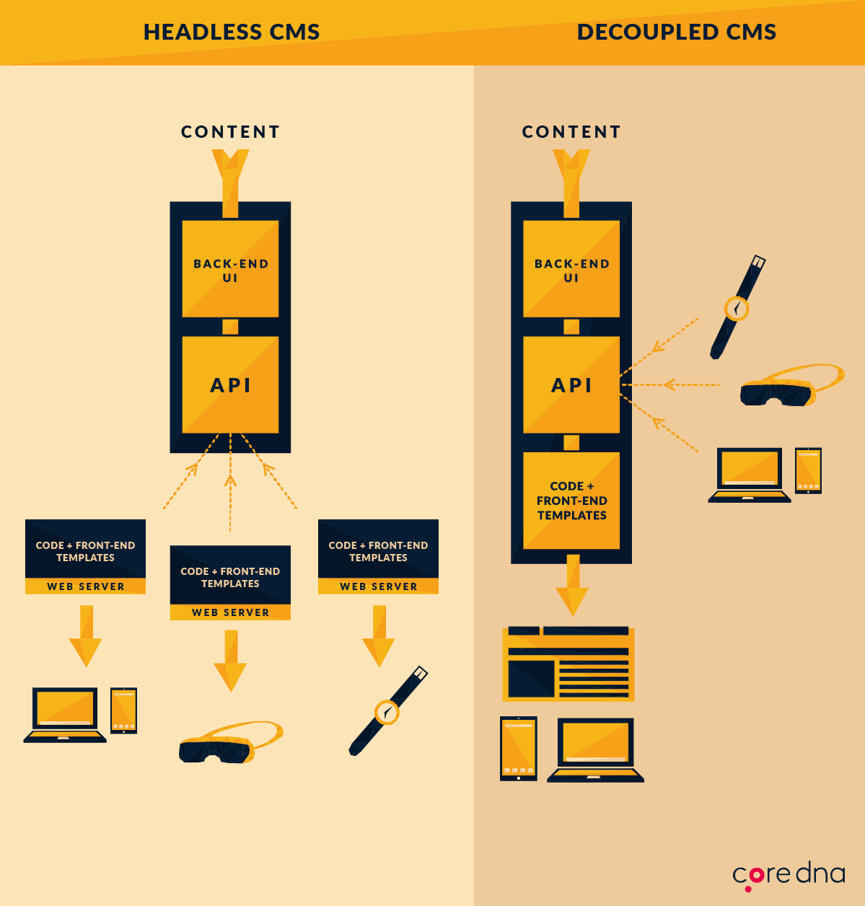

export { code as theme } from '@mdx-deck/themes'

# REST, GraphQL o JSONAPI
## (qué no hacer)

---

# ¿Por qué hablar de REST, de GraphQL, o de JSON:API?

---

<div>
  
</div>

---

<div>
  
  <p>Credit: https://teqnation.com/top-7-backend-web-frameworks-to-use-in-2019/</p>
</div>

---

<div>
  
  <p>Credit: https://www.coredna.com/blogs/headless-vs-decoupled-cms</p>
</div>

---

<div>
  
  <p>Credit: https://jobjorisenmarieke.nl/kop-op</p>
</div>

---

# REST API

* Que es REST / REST API?
* Efficiency
* Documentation, API Explorability and Schema'
* Reading Data
* Writing data

---

# JSON:API

* Que es JSON:API / JSON:API en core?
* Efficiency
* Documentation, API Explorability and Schema
* Reading data
* Writing data
* 

---

# GraphQL

* Que es GraphQL / modulo contribuido
* Efficiency
* Documentation, API Explorability and Schema
* Reading data
* Writing data
* GraphiQL? Explorer?

---

# Views REST export?

---

# ¿Qué NO hacer?

* Documentacion pobre para requerimientos especificos
* No todos los modulos estan preparados para ser expuestos por rest o json (ejemplo Paragraph)
* Que mas?

---

# https://dccr19-guestbook.netlify.com/
## QR CODE MAYBE??

---

# TLDR ACCORDING TO DOCS: TL;DR

**Choose REST if you have non-entity data you want to expose. In all other cases, choose JSON:API.**

---

```jsx
<CodeSnippet />
```

---

# The end